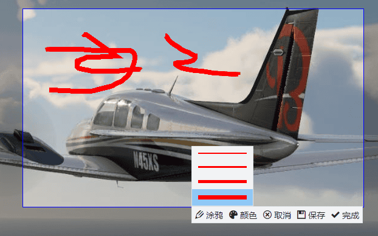
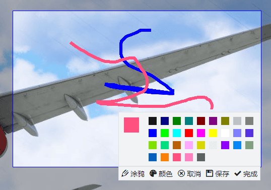
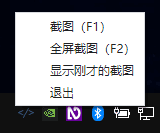

这是一个使用 Electron 编写的截图工具，使用方法和常见的截图工具差不多，启动软件后会在任务栏显示一个托盘图标，你可以使用托盘图标的菜单来截图，也可以直接按 F1 和 F2 来截图。

按下 F1 快捷键后需要通过鼠标选择截图区域：

你也可以对截图进行涂鸦：

涂鸦的颜色和笔画粗细都可以设置：

在托盘图标菜单也可以查看刚才的截图，也可以重新选择区域截图：

使用 F2 快捷键可以全屏截图，截图完成后图片会自动保存到用户的图片文件夹。

这个截图工具只是我为了测试 Electron 截图顺便开发的，Electron 的软件打包后软件的体积会比使用原生技术开发的软件大一些，好处就是方便跨平台。

我的这个 xiaoma-screenshot 截图工具的截图部分是通过 Node.js 实现的，截图完成后把图片发送到渲染进程，通过 canvas 裁剪和涂鸦。

这个截图工具没有用到其它语言编写的二进制包，软件可以打包到 Windows、Linux、Mac 三个平台，因为我使用的是 Windows，所以我这里也只打包了 Windows 的。